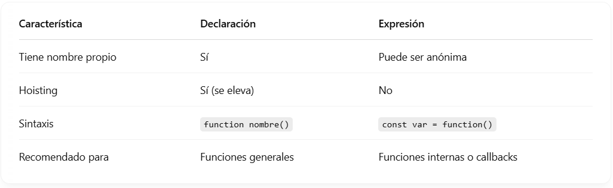

# Declaración y expresión: diferencias

## ¿Cuál es la diferencia entre una **declaración de función** y una **expresión de función** ?

### Declaración de función

Es la forma más clásica. Se usa la palabra clave `function` y un nombre.

> ```javascript
> function saludar() {
> console.log("Hola!");
> }
> ```

Las declaraciones de funciones son " **hoisted** ", lo que significa que puedes llamarlas antes de haberlas definido en el código.

**Pjemplo:**

> ```javascript
> saludar(); // Esto funciona, aunque la función se declare más abajo.
> function saludar() {
> console.log("¡Hola!");
> }
> ```

### Expresión de funciones:

Se define también con la función de palabra clave, pero no tiene un nombre (o puede tener uno, pero es opcional). Se asigna una variable.

#### **Pjemplo:**

> ```javascript
> const saludar = function() {
> console.log("¡Hola!");
> } ;
> ```

A diferencia de las declaraciones, las expresiones de funciones no son "hoisted". Esto significa que no puedes llamarlas antes de haberlas definido. Si intentas hacerlo, obtendrás un error:

> ```javascript
> saludar(); // Esto dará un error porque la función no está definida aún.
> const saludar = function() {
> console.log("¡Hola!");
> };
> ```

En **resumen** , la principal diferencia es que las declaraciones de funciones se pueden usar antes de ser definidas, mientras que las expresiones de funciones no.

<figure><figcaption></figcaption></figure>
